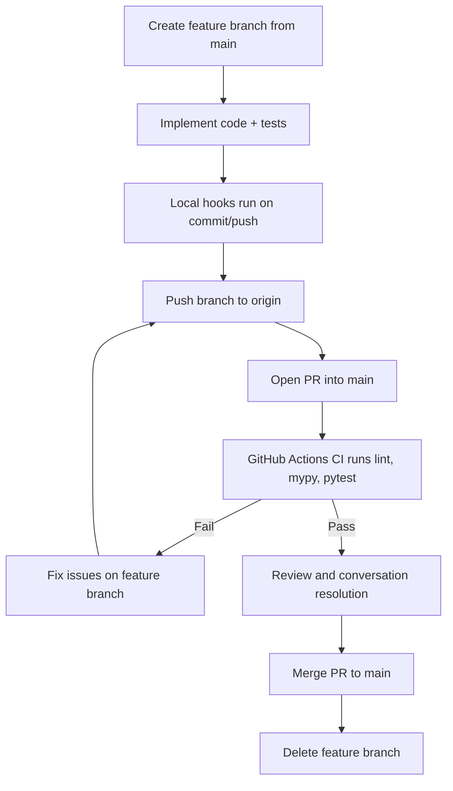

# Development Workflow

This document explains how fouriax is developed and why the project uses specific tooling.

## 1) Dependency Groups (`test` and `dev`)

### `test` group
Purpose: keep the minimum dependencies needed to validate behavior.

Included tools:
- `pytest`: test runner.
- `scipy`: reference implementation for numerical comparisons in tests.

Use case:
- CI jobs or local checks where you only want to run tests.

Install example:
```bash
pip install -e ".[test]"
```

### `dev` group
Purpose: full contributor environment.

Included tools:
- Everything needed for tests.
- `ruff`: linting and import sorting.
- `mypy`: static type checks.
- `pre-commit`: local git hook automation.

Use case:
- Daily development before opening a PR.

Install example:
```bash
pip install -e ".[dev]"
```

Why separate groups:
- Smaller, faster installs when only testing is needed.
- Clear intent for contributors and CI.
- Easier to evolve toolchain without coupling runtime dependencies to dev tooling.

## 2) Minimal Quality Configuration

The project currently uses light-weight rules that catch common issues without slowing iteration too much.

### Linting (`ruff`)
Configured in `pyproject.toml`:
- Rule families: `E`, `F`, `I`, `B`
- Goal: catch syntax/logic issues, import ordering, and common bug-prone patterns.

Command:
```bash
ruff check .
```

### Type checking (`mypy`)
Configured in `pyproject.toml`:
- Scope: `src/`
- `ignore_missing_imports = true` for early-stage compatibility while library boundaries are stabilizing.

Command:
```bash
mypy src
```

### Testing (`pytest`)
Configured in `pyproject.toml`:
- Tests discovered from `tests/`
- Uses quiet output (`-q`) by default.

Command:
```bash
pytest
```

## 3) Protected GitHub Workflow

### CI purpose
CI runs quality checks on each PR to `main` and each push to `main`.

Workflow file:
- `.github/workflows/ci.yml`

Checks executed:
1. `ruff check .`
2. `mypy src`
3. `pytest`

### Branch protection purpose
Branch protection turns process into enforceable policy. This prevents unreviewed or untested changes from landing in `main`.

Recommended GitHub settings for `main`:
1. Require a pull request before merging.
2. Require status checks to pass before merging.
3. Require branches to be up to date before merging.
4. Require conversation resolution before merging.
5. Optionally require at least 1 approving review.

### Day-to-day flow
1. Branch from `main`:
```bash
git checkout -b feat/<short-name>
```
2. Implement and run checks locally:
```bash
ruff check .
mypy src
pytest
```
3. Push branch and open PR to `main`.
4. Address review/CI feedback.
5. Merge PR after checks pass.

## 4) Pre-commit Hooks (Local Enforcement)

Config file:
- `.pre-commit-config.yaml`

What runs:
- On commit: basic repository hygiene + `ruff` + `mypy`.
- On push: `pytest`.

Setup:
```bash
pip install -e ".[dev]"
pre-commit install
pre-commit install --hook-type pre-push
```

Repo helper setup (recommended):
```bash
scripts/dev_setup.sh
```
This creates/updates `.venv`, installs `.[dev]`, and installs pre-commit hooks.

Manual run:
```bash
pre-commit run --all-files
```

Local lint gate (CI parity for lint/type checks):
```bash
scripts/lint_local.sh
```

Why this helps:
- catches common issues before code leaves your machine,
- reduces CI churn from avoidable failures,
- partially compensates when GitHub branch protection is limited.

## 5) Closed Feature Cycle (GitHub Actions)



## 6) Why this matters for fouriax

fouriax targets differentiable numerical code where small regressions can be subtle.

This workflow helps by:
- catching obvious defects quickly (`ruff`),
- flagging interface/typing mistakes early (`mypy`),
- validating numerical behavior against references (`pytest` + SciPy),
- ensuring `main` remains reliable through enforced PR + CI gates.

## 7) Visual Verification

For manual visual inspection, use scripts rather than tests.

- Example benchmark plot script:
  - `scripts/lens_benchmark_plot.py`
- Run:
```bash
PYTHONPATH=src python scripts/lens_benchmark_plot.py
```
- Output image:
  - `artifacts/lens_benchmark_profile.png`
