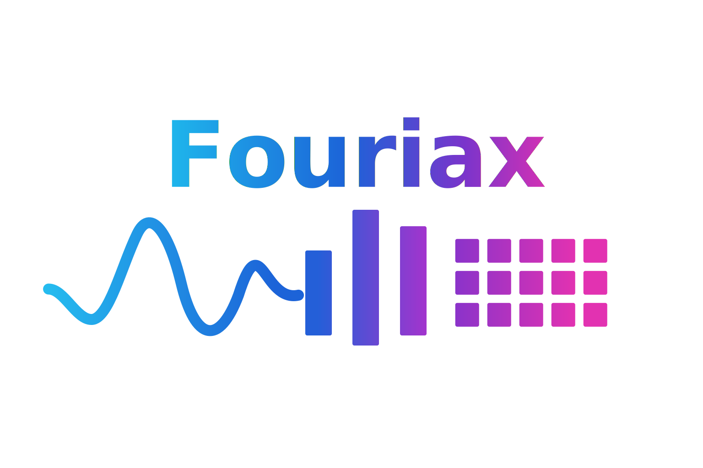

<div style="text-align: center; margin-bottom: 2rem;">
  
</div>

# fouriax

Differentiable free-space optics for JAX.

```{warning}
This project is **vibecoded**. It's primarily developed by collaborating with AI coding assistants. While we strive for correctness, expect experimental features, rapid iterations, and potentially non-traditional implementation structures.
```

`fouriax` is a JAX library for simulating and optimizing coherent and incoherent optical systems with automatic differentiation. It provides composable optics layers, explicit spatial and k-space transforms, propagation planning, Jones polarization, meta-atom lookup tables, and sensor readout for gradient-based inverse design.

## Sections

- {doc}`Guides <guides/index>`: user-facing explanations and conceptual documentation.
- {doc}`API Reference <api/index>`: generated reference pages for the core library surface.
- {doc}`Examples <examples/index>`: synced example notebooks rendered as documentation pages.
- {doc}`Development <development/index>`: local setup, testing, and contributor workflow.

## Key Features

- Composable optical stacks built around `OpticalLayer` and `OpticalModule`
- Explicit spatial and k-space transitions via Fourier transform layers
- Multiple propagation backends with automatic planning
- Jones polarization support
- Meta-atom interpolation layers
- Incoherent imaging and detector models
- Differentiable optimization workflows built on JAX and Optax

```{toctree}
:maxdepth: 2

guides/index
api/index
examples/index
development/index
```
